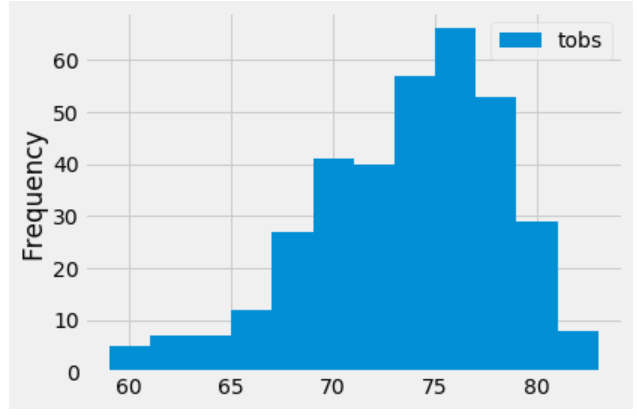

# surfs_up

## Module 9 Challenge

The Challenge was to gather data on the seasons of Oahu and determine whether the seasons could affect the surf and ice cream shop business. Specifically, were there certain times of the year when business might be slower, or the type of customer could be different.

An exploratory climate analysis was done for the 12 month period between August 2017 and August 2018. The precipitation plot for this period is provided below:

The Station with the highest number of observations (USC00519281) was choose for further analysis. A plot of this station's temperature frequency is shown below:

Key temperature statistical data was reviewed for this period at this station. The summary of the temperature from this station for the months of June and December is provided below:

Analysis of this summary data indicates:

  - The counts are close enough (1700 vs. 1517) to consider both June and December data reliable at this station.
  - The maximum temperatures were close with 85 vs. 83 for June and December, respectively.
  - The minimum temperatures were further apart with 64 vs. 56 for June and December, respectively, but only an 8 degree difference.
  - The mean temperatures were within 4 degrees at 74.9 vs. 71.0 for June and December, respectively.
  - The standard deviations were close 3.36 vs. 3.75 for June and December, respectively indicating similar data quality.
  - Across the range of temperatures, the percentiles for December were only about 3 degrees lower.

Overall, the temperature data incdicates there is not much variability in seasons with just 3 degrees difference in temperature. This would indicate that the type of people expected to frequent the shop would be the same year round and may only vary by the surfing conditions, with more surfers frequenting in better surfing weather.

Further analysis could be done to refine the results by:
  - Looking at precipitation since the precipitation graph (above) indicates some variability in precipitation based on seasons.
  - Look at other months in the summer and winter to ensure the June and December data are representative.
  - Look for the station that is closest to the likely location of the shop to see if there is any variability from the station with the highest frequency.

Overall the analysis shows that seasonal varability in temperature will NOT be a factor for shop business.

